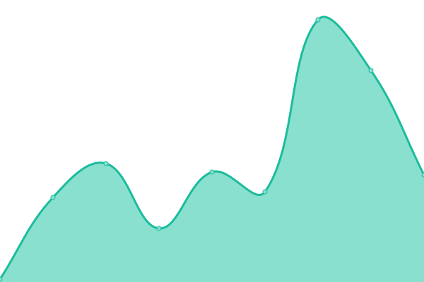

# [📈 Live Status](https://GameDiscoverCo.github.io/uptime): <!--live status--> **🟧 Partial outage**

This repository contains the open-source uptime monitor and status page for [GameDiscoverCo](https://gamediscover.co), powered by [Upptime](https://github.com/upptime/upptime).

With [Upptime](https://upptime.js.org), you can get your own unlimited and free uptime monitor and status page, powered entirely by a GitHub repository. We use [Issues](https://github.com/GameDiscoverCo/uptime/issues) as incident reports, [Actions](https://github.com/GameDiscoverCo/uptime/actions) as uptime monitors, and [Pages](https://GameDiscoverCo.github.io/uptime) for the status page.

<!--start: status pages-->
<!-- This summary is generated by Upptime (https://github.com/upptime/upptime) -->
<!-- Do not edit this manually, your changes will be overwritten -->
<!-- prettier-ignore -->
| URL | Status | History | Response Time | Uptime |
| --- | ------ | ------- | ------------- | ------ |
|  [GameDiscoverCo Plus](https://plus.gamediscover.co) | 🟩 Up | [game-discover-co-plus.yml](https://github.com/GameDiscoverCo/uptime/commits/HEAD/history/game-discover-co-plus.yml) | 

 330ms
     
 | 

<a href="https://status.gamediscover.co/history/game-discover-co-plus">100.00%</a>
    

|  [GameDiscoverCo Console](https://console.gamediscover.co) | 🟩 Up | [game-discover-co-console.yml](https://github.com/GameDiscoverCo/uptime/commits/HEAD/history/game-discover-co-console.yml) | 

 370ms
     
 | 

<a href="https://status.gamediscover.co/history/game-discover-co-console">100.00%</a>
    

|  [Company site](https://gamediscover.co/) | 🟩 Up | [company-site.yml](https://github.com/GameDiscoverCo/uptime/commits/HEAD/history/company-site.yml) | 

 284ms
     
 | 

<a href="https://status.gamediscover.co/history/company-site">100.00%</a>
    

|  API | 🟩 Up | [api.yml](https://github.com/GameDiscoverCo/uptime/commits/HEAD/history/api.yml) | 

 373ms
     
 | 

<a href="https://status.gamediscover.co/history/api">100.00%</a>
    

|  Scraping | 🟥 Down | [scraping.yml](https://github.com/GameDiscoverCo/uptime/commits/HEAD/history/scraping.yml) | 

 102ms
     
 | 

<a href="https://status.gamediscover.co/history/scraping">0.00%</a>
    

<!--end: status pages-->

[**Visit our status website →**](https://GameDiscoverCo.github.io/uptime)

## 📄 License

- Powered by: [Upptime](https://github.com/upptime/upptime)
- Code: [MIT](./LICENSE) © [Anand Chowdhary](https://anandchowdhary.com), supported by [Pabio](https://pabio.com)
- Data in the `./history` directory: [Open Database License](https://opendatacommons.org/licenses/odbl/1-0/)
